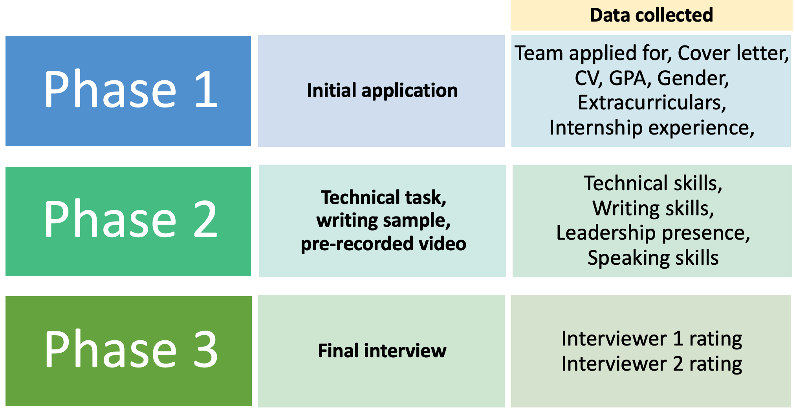
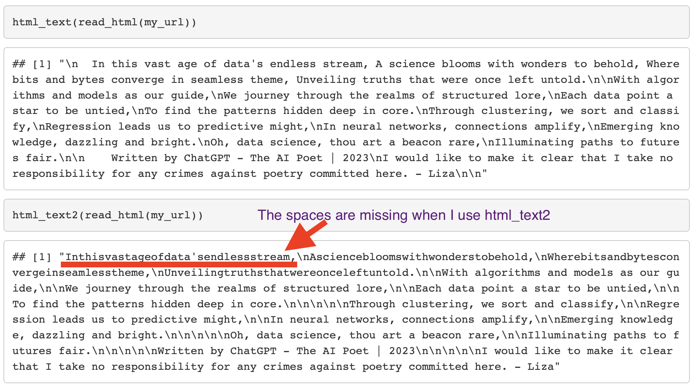

```{r setup, include = FALSE}
# This RMD uses the the unilur package to simultaneously produce the answers and instructions
knitr::opts_chunk$set(
  collapse = TRUE,
  comment = "#>"
)

knitr::opts_template$set(marking = list(box.title = "Grading notes",
                                      box.body = list(fill = "#FFFFFF", colour = "#000000"),
                                      box.collapse = TRUE, solution = T,
                                      box.icon = "fa-check"))

library(tidyverse)
library(GGally)
```

# Instructions

* **Submission requirements**: You must submit both the HTML and Rmd with your solutions. It is suggested that you use the template provided for labs and assignments.  
  * Marks will be lost for poorly organised submissions — see [Penalties to avoid](#penalties). Use headings for each task and clearly indicate your answers to subtasks, as appropriate.
  * Comment code in the code chunks at a reasonable level so that another person with some R familiarity could easily follow your thinking and process. This doesn't mean every single line must be commented, but the overall **purpose** should be clear.
  * All code should be shown in your HTML (i.e., don't hide any code), but messages from loading packages and data should be suppressed. `message = F` and `warning = F` are useful for your libraries chunk.
  * Your first code chunk should load all your libraries (don't include libraries you're not using).
  * There should be no `install.packages()` code in your submission. Package installs can be done in the console and should not be run every time you knit.

* **Late submissions**: Late submissions are accepted for *up to three days* with a 10 percentage point-per-day penalty (pro-rated to an hourly penalty of 0.42 percentage points per hour). Make sure you submit BEFORE 23:59. A 1 hour late penalty may apply to submissions that are processed by Canvas at exactly the deadline.
  * Note: You can submit as many times as you like before the deadline. 
* **Allowed libraries**: Students come to this course with different coding backgrounds. To help keep this course fair, you will be asked to generally rely on the packages and functions we use in class and labs to answer code questions in the main questions in these assignments. (Bonus questions, are fair game for showing-off and Googling). 
  * Tidyverse: For example, as we have a focus on Tidyverse, you are expected to use Tidyverse to achieve the wrangling and visualisation solutions. 
  * Other packages: If there are other packages you like to use and their use won't detract from our ability to assess your knowledge of the course content, you CAN use them, but please ensure you explain what they are for (comments on the code are appropriate). Doing a good job of this helps the markers see that you understand the code and have been thoughtful about it, and that you haven't just copied something from StackOverflow or ChatGPT without understanding what the course is about. 
* Use a **referencing style** of your choice to reference relevant resources used as you work on your assignment. Class slides do not need to be referenced. There should be paired in-text citations and a references section at the end. 

# Task 1: Revision [3 marks]

From the [Course Outline](https://courseoutline.auckland.ac.nz/dco/course/STATS/369/1235) the pre-requisites for this class are: STATS 220 and STATS 210 or 225 and 15 points from ECON 221, STATS 201, 208, or ENGSCI 314.

Choose one of these courses (presumably one you've taken) and write one multichoice question on a topic from that course. The audience should be your peers in this course who are aiming to revise topics from the prerequisites. *If I have time, I will make some of these into a practice quiz on Canvas. You can just write a note if you don't want your question considered for inclusion, it won't affect your mark.*

* Make it clear for which **course** this is revision.
* Your question should have **4 options** (1 correct and 3 distractors)
* Write an **answer key** that explains which answer is correct and why the others are wrong.

You will be marked on the correctness and quality of your question and explanation. The question does not have to be *hard*, per se, but should be **USEFUL** to you and your fellow students. 


```{block, opts.label = "marking"}
Marking scheme to be added
```

<hr> 

# Task 2: Algorithmic fairness audit (mini-consulting project) [11 marks]

A company called Black Saber^[This isn't a real company] has been trialling a new AI recruitment pipeline manager for their Data and Software teams. There are three phases, outlined below, each narrowing down the field of applicants. Based on advice from their legal team, they are not able to provide you with the original application data, but they can provide these anonymised indicators/ratings from each phase. `applicant_id` is consistent across phases.



## Data explanation

### Phase 1

`phase1-new-grad-applicants-2022.csv`

In the first phase of the hiring pipeline applicants complete a form and are asked to submit a CV and cover letter. Extracurriculars and internship experience are auto-rated based on the descriptions applicants provide in the application form.

| Variable      | Description                     |
|---------------|---------------------------------|
|`applicant_id` | A unique ID assigned to applicants in Phase 1 |
|`team_applied_for` | Software or Data |
|`cover_letter` | 0 if absent, 1 if present       |
|`cv`           | 0 if absent, 1 if present       |
|`gpa` | 0.0 to 4.0 (American style)|
|`gender`         |Gender of employee: 'Man', 'Woman', 'Prefer not to say' only options provided|
|`extracurriculars`| The description of extracurricular involvement is assessed against a proprietary key term and phrase bank and given a 0, 1 or 2 for where 2 indicates several high relevance and/or skills building extracurriculars, 1 indicates some relevant and/or skills building extracurriculars and 0 indicates no extracurriculars describes or that those describe were not rated as high relevance or high skills building| 
|`work_experience` | Similar to `extracurriculars`, the description applicants provided is assessed against a proprietary key term and phrase bank, that also considers company names and reputations, to give a 0, 1 or 2 score, with 2 being the best, 0 the worst|


### Phase 2

`phase2-new-grad-applicants-2022.csv`

We don't know exactly how these are being assessed by the AI, the algorithm is commercially sensitive but their demonstrations of the system were impressive.

| Variable      | Description                     |
|---------------|---------------------------------|
|`applicant_id` | A unique ID assigned to applicants in Phase 1 |
|`technical_skills`|Score from 0 to 100 on a timed technical task, AI autograded|
|`writing_skills`  |Score from 0 to 100 on a timed writing task, AI autograded|
|`speaking_skills` |A rating of speaking ability based on pre-recorded video, AI autograded|
|`leadership_presence` |A rating of 'leadership presence' based on pre-recorded video, AI autograded|

### Phase 3

`phase3-new-grad-applicants-2022.csv`

This is the information from interview phase. Being listed as 'first' or 'second' interviewer is arbitrary and who the interviewers were is not available from our tracking system. Applicant IDs are listed across the top and then the two scores for the applicant are listed below their ID.

The average score of the two interviewers was used to determine final hires.

### Final hires

`final-hires-newgrad_2022.csv`

This data set contains the applicant IDs of everyone who was sent an offer letter. In this cohort, everyone accepted.

| Variable      | Description                     |
|---------------|---------------------------------|
|`applicant_id` | A unique ID assigned to applicants in Phase 1 |

## Subtasks

1. Load, wrangle and join these datasets in to ONE appropriate tidy dataset where each applicant is an observation. Create 3 indicator variables for whether or not each applicant passed a given phase (e.g., final hires *passed* phase 3). These indicators can be 0/1 numerics or have text levels — up to you. Show the head (`head()`) of your finished dataset's first **10 rows** (do *not* print the whole thing!) [4 marks]

```{r, solution = T, message=F}
# Read in each round and final hires
first_round <- read_csv("data/2022-phase1-new-grad-applicants.csv") 
second_round <- read_csv("data/2022-phase2-new-grad-applicants.csv") |> 
  mutate(passed1 = 1)
third_round <- read_csv("data/2022-phase3-new-grad-applicants.csv")
final_hires <- read_csv("data/2022-final-hires-newgrad.csv")
  
# Third round needs to be made tidy and the average scores calculates
third_tidy <- third_round |> 
  pivot_longer(-applicant_id) |> 
  rename(interview = "applicant_id", applicant_id = "name", score = "value") |> 
  group_by(applicant_id) |> 
  summarise(interview_score = mean(score)) |> 
  # Make ID numeric to join with the others
  mutate(applicant_id = as.numeric(applicant_id)) |> 
  mutate(passed2 = 1)

# Must add another variable to the final_hires dataset to indicate being a final hire
final_hires <- final_hires |> 
  mutate(hired = "hired") |> 
  mutate(passed3 = 1)

# Join all cleaned datasets
all_data <- first_round |> 
  left_join(second_round) |> 
  left_join(third_tidy) |> 
  left_join(final_hires) |> 
  # Optional organising
  select(applicant_id, starts_with("pass"), everything())

head(all_data)
```

2. Create appropriate numeric summaries, basic statistical tests (think t-test or ANOVA/F-test) and at least ONE appropriate chart to explore whether their are any concerns about this new AI recruitment pipeline.^[Hint: The interview scores aren't based on AI. Of the previous phases, consider which of these parts of the pipeline might be most impacted by potential bias in the training data. E.g., GPA is just being read from the form so probably doesn't have bias issues. You might be interested to know that some studies suggest people (specifically American voters, but may be more generalisable) prefer leaders with lower-pitched voices (https://doi.org/10.1371/journal.pone.0133779) and that Amazon had to scrap it's AI recruitment system due to bias (https://www.businessinsider.com/amazon-ai-biased-against-women-no-surprise-sandra-wachter-2018-10)] [4 marks]

```{r, solution = T, warning = F, message = F}
# Pairs plot
GGally::ggpairs(all_data)

all_data |> 
  ggplot(aes(x = gender, y = leadership_presence)) +
  geom_boxplot()

all_data |> 
  ggplot(aes(x = gender, y = speaking_skills)) +
  geom_boxplot()

# A basic anova suggests that mean speaking skills ratings are not the same for all gender groups
anova(lm(all_data$speaking_skills ~ all_data$gender))

# A basic anova suggests that mean leadership presence ratings are not the same for all gender groups
anova(lm(all_data$leadership_presence ~ all_data$gender))
```

```{block, opts.label = "marking"}
Will be added
```

3. Write 'alt text' for the chart you created above based on the advice from [*Writing Alt Text for Data Visualization* by Amy Cesal](https://nightingaledvs.com/writing-alt-text-for-data-visualization/). If you created more than one chart, pick one to write about. Assume this alt text would also be geared towards an audience of Black Saber Executives — you do not need to link the data as it is their data, but it would be worth being clear about. [1 mark]

```{block, opts.label = "marking"}
Will be added
```

4. Write a short^[Approximately 100 to 300 words] conclusion for Black Saber on whether their new AI applicant processing system appears to be working well. Highlight any potential risks to your client. Address your comments to an audience of executives who may not have much statistical or data knowledge. [2 marks]

```{block, opts.label = "marking"}
Will be added
```

#### Bonus opportunity [+1 bonus]

Create the UGLIEST version of the graph you created about that you can. Dancing T-rex as the background or colours that make your eyes bleed? Go for it! Note: You are free to use any functions you can find, you don't have to stick as closely to course content.

```{block, opts.label = "marking"}
More notes will be added here after Friday's lab.
```

<hr>

# Task 3: Reprex critique [3 marks]

Consider the following code. It scrapes the text of a poem about statistics from a webpage.^[We should always consider the ethics of web scraping. In this case, our target is *my* site, and I've set it up for you to scrape so we don't have to do any other work.]

## Original code

```{r, echo=F, message = F, warning = F}
library(rvest)
```

```{r}
html_text(read_html("https://link.lizabolton.com/a_scrapable_poem.html"))
html_text2(read_html("https://link.lizabolton.com/a_scrapable_poem.html"))
```

This works as expected when scraping using `html_text`, but has a problem when using `html_text2`. These are both functions from the `rvest`  package [@rvest] and `html_text2` provides more nicely formatted outputs, i.e., according to the help text: "html_text2() simulates how text looks in a browser, using an approach inspired by JavaScript's innerText(). Roughly speaking, it converts \⁠\<br /\>⁠ to ``\\n'', adds blank lines around  \<p>⁠ tags, and lightly formats tabular data." 

Our problem is that when using `html_text2`, some of the spaces are dropped and the words are all smushed together as part of this reformatting.

Suppose three students have each created an example to report this potential bug to the `rvest` development team. Using the article on reprex dos and don'ts [@reprex-dos-donts] and broader information about the reprex philosophy, choose THREE things to compare and contrast these three samples on.

Note: You do NOT need to be able to read the HTML to answer this question.


### Bug report example A



### Bug report example B
``` r
library(rvest)
html_text(read_html("https://link.lizabolton.com/a_scrapable_poem.html"))
#> [1] "\n  In this vast age of data's endless stream, A science blooms with wonders to behold, Where bits and bytes converge in seamless theme, Unveiling truths that were once left untold.\n\nWith algorithms and models as our guide,\nWe journey through the realms of structured lore,\nEach data point a star to be untied,\nTo find the patterns hidden deep in core.\nThrough clustering, we sort and classify,\nRegression leads us to predictive might,\nIn neural networks, connections amplify,\nEmerging knowledge, dazzling and bright.\nOh, data science, thou art a beacon rare,\nIlluminating paths to futures fair.\n\n    Written by ChatGPT - The AI Poet | 2023\nI would like to make it clear that I take no responsibility for any crimes against poetry committed here. - Liza\n\n"
html_text2(read_html("https://link.lizabolton.com/a_scrapable_poem.html"))
#> [1] "Inthisvastageofdata'sendlessstream,\nAsciencebloomswithwonderstobehold,\nWherebitsandbytesconvergeinseamlesstheme,\nUnveilingtruthsthatwereonceleftuntold.\n\nWith algorithms and models as our guide,\n\nWe journey through the realms of structured lore,\n\nEach data point a star to be untied,\n\nTo find the patterns hidden deep in core.\n\n\n\n\nThrough clustering, we sort and classify,\n\nRegression leads us to predictive might,\n\nIn neural networks, connections amplify,\n\nEmerging knowledge, dazzling and bright.\n\n\n\n\nOh, data science, thou art a beacon rare,\n\nIlluminating paths to futures fair.\n\n\n\n\nWritten by ChatGPT - The AI Poet | 2023\n\n\n\n\nI would like to make it clear that I take no responsibility for any crimes against poetry committed here. - Liza"
```

<sup>Created with [reprex v2.0.2](https://reprex.tidyverse.org)</sup>

### Bug report example C
``` r
library(rvest)
some_html <- '<p dir="ltr" style="text-align:left;"></p><span style="font-size:0.9375rem;">The sentence starts this way,</span><span style="font-size:0.9375rem;"> </span><span style="font-size:0.9375rem;">then</span><span style="font-size:0.9375rem;"> </span><span style="font-size:0.9375rem;">spaces</span><span style="font-size:0.9375rem;"> </span><span style="font-size:0.9375rem;">disappear</span>'
html_text(read_html(some_html)) # is correct
#> [1] "The sentence starts this way, then spaces disappear"
html_text2(read_html(some_html))  # not correct
#> [1] "The sentence starts this way,thenspacesdisappear"
```

<sup>Created with [reprex v2.0.2](https://reprex.tidyverse.org)</sup>


```{block, opts.label = "marking"}
There are several points that could matter here. Sensible comments include:

1. B & C allow a reader to copy and paste the code (one of the three key aspects of a good reprex), but A is a screenshot and makes that harder.
2. A does not give all the commands we need as it does not include  `library(rvest)`. B & C do. 
3. Both A and B require scraping of the original website while C provides a minimal example of the problem that people can run without needing to scrape or even connect to the internet. This means that C does better on providing a MINIMAL example and show the writer really understands what  issue they are trying to report a bug for and done the work to test it out. It is also more polite to the site you're scraping to not cause additional uneeded scraping.
4. All 3 include the output ('doesn't have to be run' philosophy point), which is a key part of a good reproducible example. Another good point of all three is that the code has been run, another point of the philosophy of a good reprex.
```

<hr>

# Task 4: Reflection [3 marks]

1. Read over the [current graduate capability themes, LEVEL 2: Graduate Capabilities – Themes](https://www.auckland.ac.nz/en/students/forms-policies-and-guidelines/student-policies-and-guidelines/graduate-profile.html) or the refreshed version that connects to [Taumata Teitei](https://www.auckland.ac.nz/en/on-campus/life-on-campus/latest-student-news/curriculum-framework-transformation-programme0/university-graduate&~_). Choose one specific task or subtask in this assignment or in lab 01 or lab 02 and discuss how your work demonstrates ONE of these specific capabilities. Make sure you explain the capability in your own words as well as referencing the graduate profile. Assume your audience is the HR team at a potential employer for the Data Science job of your dreams. Write ~100 to 300 words. [2 marks]
 
```{block, opts.label = "marking"}
 Marks for reasonable effort. 
 It should be clear which task and which capability they are connecting.
 
Examples could be their summary for Black Saber in this assessment connecting to '4. Communication and Engagement', as they are writing a summary for a non-stats audience, or it could also connect to '3. Solution Seeking' — addressing issues of gender bias are part of  "developing ‘solutions that shape and advance our
futures’."
```
 
 2. What is something you're proud of in the assignment? [0.5 marks]
 
```{block, opts.label = "marking"}
Marked on effort. Writing does not need to be perfect, but should be readable with minimal challenge.
```
 
 3. What is something you're going to do differently for the next assignment? [0.5 marks]
 
```{block, opts.label = "marking"}
Marked on effort. Writing does not need to be perfect, but should be readable with minimal challenge.
```

# ⚠️⚠️⚠️ Penalties to avoid ⚠️⚠️⚠️ {#penalties}

- **-1 mark** for not showing (don't `echo = F`!) a setup chunk at/near the beginning of your submission. It should include all the required libraries and  suppress package loading messages and not have any `install.packages()` commands.
- **-1 mark** for missing/incomplete references. Make sure you have both an in-text citation and then also the association full reference in your references section. UoA has a resource called [QuickCite](https://www.cite.auckland.ac.nz/2.html) to help you.
- **-2 marks** for not uploading one of the required files (HTML or Rmd).
- Up to **-2 marks** for poor formatting (unless extreme issues).
- Up to **-1 marks** for insufficient commenting of code.

# References

*Remember to include references if you use AI, and you should reference the Graduate Capabilities document use use in the reflection and the 'dos and don'ts' article*.
